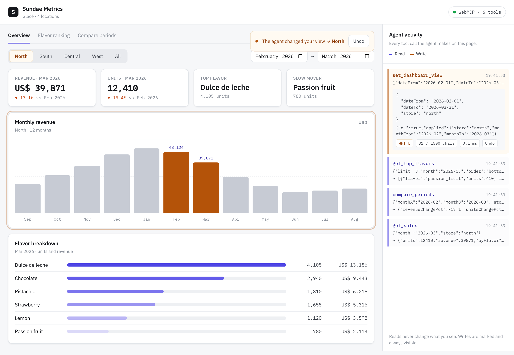
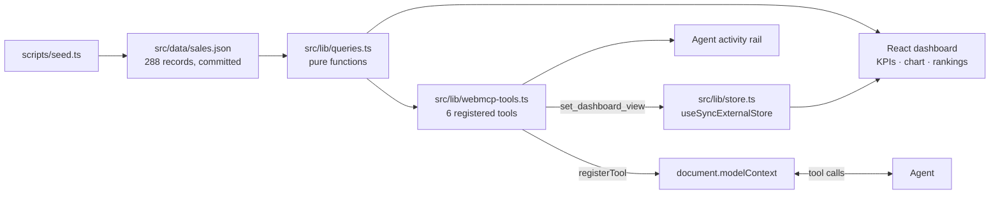
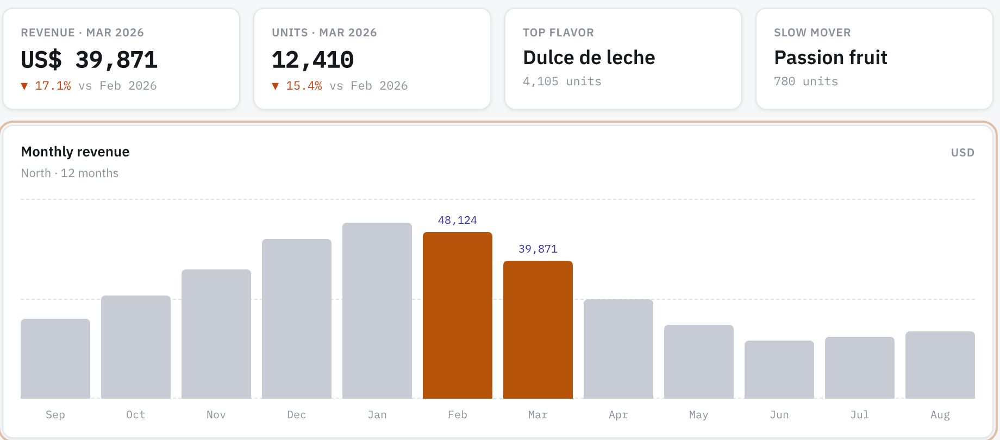
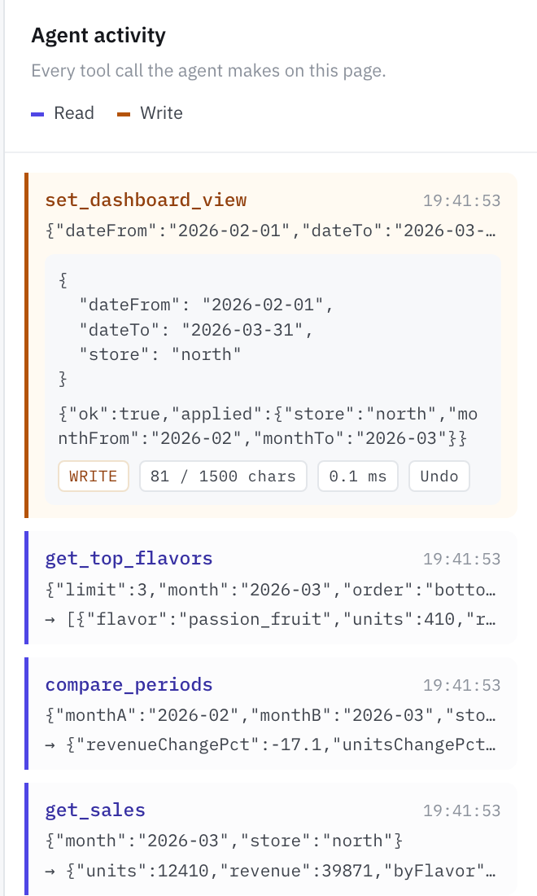
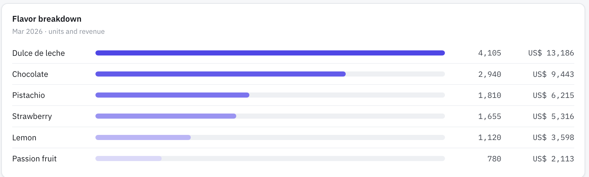

<p align="center">
  
</p>

<h1 align="center">Sundae Metrics</h1>

<p align="center">
  <b>A sales dashboard that hands an agent six tools instead of a picture of a chart.</b><br>
  Same question, same page, same model: 4 min 38 s without WebMCP, 36 seconds with it.
</p>

<p align="center">
  <b><a href="https://sundae-metrics.vercel.app">Live demo</a></b> ·
  <b><a href="https://youtu.be/dK6HtZhCsRE">2:36 demo video</a></b> ·
  <b><a href="https://devpost.com/software/sundae-metrics">Devpost</a></b> ·
  <b><a href="https://webmcp.devpost.com/">The WebMCP Challenge</a></b>
</p>

<p align="center">
  
  
  
  
  
  
</p>

---

<p align="center">
  <a href="https://sundae-metrics.vercel.app"></a><br>
  <sub>Glacé · 4 shops, 12 months, 6 flavors. The rail on the right is every tool call the agent made.</sub>
</p>

> [!IMPORTANT]
> **The 30-second version.** Ask an agent "how much did sales at the North location change between February and March?" while it is looking at this dashboard. Without WebMCP it has to drive the interface — find the selector, synthesize a click, wait for a re-render with no completion signal, read the numbers back off the screen. It gets the right answer in **4 minutes 38 seconds**. With the six tools registered it is one call and **36 seconds**. The claim is about cost, not capability.

- [The problem](#the-problem) — what an agent has to do without tools
- [The bar that hides the problem](#the-bar-that-hides-the-problem) — a 74% collapse inside the best month of the year
- [The 6 tools](#the-6-tools) — contracts, inputs, outputs, readOnlyHint
- [One source of truth](#one-source-of-truth) — why a chart value and a tool value cannot drift
- [Why WebMCP is what makes this work](#why-webmcp-is-what-makes-this-work) — cost, write tools, and the activity rail
- [Trying it](#trying-it) — ChatGPT desktop, or Chrome 149+ behind a flag
- [Running it locally](#running-it-locally)

## The problem

The owner of the chain asks an assistant, while looking at this same screen: *"How much did sales at the North location change between February and March?"*

It gets there. This chart prints its values as text, so the agent reads them rather than measuring pixels, and the answer it comes back with is correct — **that is measured, not assumed.** What it cannot do is get there cheaply.

With the tools registered, it is one call:

```js
await compare_periods({ store: "north", monthA: "2026-02", monthB: "2026-03" });
// {"revenueChangePct":-17.1,"unitsChangePct":-15.4}
```

## The bar that hides the problem

The dataset carries a second case, and this one the chart actively hides. In January 2026 the North location's pistachio sales collapse from 2,099 units to 554 — down **74%**, from the 3rd best seller to the 6th. A supply shortage. But January is also North's **highest-revenue month of the year** (50,800): the other five flavors each rise about 24% and absorb the gap.

> [!WARNING]
> The tallest bar on the chart is the one hiding the problem. Nothing on screen shows it. One tool call does:

```js
await get_top_flavors({ store: "north", month: "2026-01", limit: 3, order: "bottom" });
// [{"flavor":"pistachio","units":554,...}, ...]
```

## The 6 tools

Registered with `document.modelContext.registerTool()` from [src/lib/webmcp-tools.ts](src/lib/webmcp-tools.ts).

| Tool | What it does | Input | Output | readOnlyHint |
|---|---|---|---|:---:|
| `list_stores` | Lists the locations on this dashboard | — | `[{id, name, city}]` | ✅ |
| `get_sales` | Exact units and revenue for one location in one month | `{store, month}` | `{units, revenue, byFlavor}` | ✅ |
| `compare_periods` | Percentage change between two months | `{store, monthA, monthB}` | `{revenueChangePct, unitsChangePct}` | ✅ |
| `get_top_flavors` | Flavor ranking, best sellers **or slow movers** | `{store?, month?, limit, order?}` | `[{flavor, units, revenue}]` | ✅ |
| `get_summary` | Revenue across every location over a date range | `{dateFrom, dateTo}` | `{totalRevenue, byStore}` | ✅ |
| `set_dashboard_view` | **Changes what the user is looking at** | `{store?, dateFrom?, dateTo?}` | `{ok, applied}` | ✍️ write |

<details>
<summary>Real calls and real responses, straight from the page</summary>

```js
await get_sales({ store: "north", month: "2026-03" });
// {"units":12410,"revenue":39871,"byFlavor":[
//   {"flavor":"dulce_de_leche","units":4105,"revenue":13186},
//   {"flavor":"chocolate","units":2940,"revenue":9443},
//   {"flavor":"pistachio","units":1810,"revenue":6215}, ...]}

await get_top_flavors({ store: "south", month: "2026-03", limit: 3, order: "bottom" });
// [{"flavor":"passion_fruit","units":410,...},{"flavor":"lemon","units":695,...},
//  {"flavor":"strawberry","units":1105,...}]

await set_dashboard_view({ store: "north", dateFrom: "2026-02-01", dateTo: "2026-03-31" });
// {"ok":true,"applied":{"store":"north","monthFrom":"2026-02","monthTo":"2026-03"}}
```

</details>

`order: "bottom"` is not decoration. The KPI that HioPOS, Sipos and GETPOS actually sell to ice cream shops is "best sellers **and** slow movers", because owners use the second half to decide what to drop from the menu. It costs one parameter, not a seventh tool.

## One source of truth



<p align="center"><sub>The dashboard and the tools call the same pure functions, so a chart value and a tool value cannot drift apart.</sub></p>

`39,871` is the number `get_sales` returns, the number printed on the March bar, and the number in the KPI card — because [src/lib/queries.ts](src/lib/queries.ts) is the only place in the codebase that computes anything.

## What you are looking at

<table>
<thead>
<tr><th>The dashboard</th><th>Agent activity rail</th><th>Flavor breakdown</th></tr>
</thead>
<tbody>
<tr>
<td></td>
<td></td>
<td></td>
</tr>
<tr>
<td>Four KPI cards and twelve months of revenue. Every value is printed as text, not only drawn as a bar.</td>
<td>Every call as it happens: name, input, output, elapsed time, size against the 1,500-char ceiling, and Undo.</td>
<td>Six flavors ranked by units and revenue — the same numbers <code>get_top_flavors</code> returns, from the same functions.</td>
</tr>
</tbody>
</table>

## Why WebMCP is what makes this work

**The tools are not a convenience layer.** An agent can reconstruct a figure from a rendered dashboard — it just pays for it in clicks, re-renders and round trips, and the price is 4 minutes 38 seconds against 36. Six tools turn a picture into an API without asking the user to leave the page they are already on.

**`set_dashboard_view` runs the other way.** It is the only tool with `readOnlyHint: false`, declared explicitly even though `false` is the default. Ask for the South location and the screen changes in front of you: the agent acts on the same interface the human is looking at, rather than on a copy of the data somewhere else.

**The Agent activity rail is the security answer, not chrome.** How much a site should have to reveal about what an agent did on it is still open in the standard — prompt injection ([webmcp#11](https://github.com/webmachinelearning/webmcp/issues/11)) and hints for consequential actions ([webmcp#176](https://github.com/webmachinelearning/webmcp/issues/176)) are both unresolved. This dashboard's response is to make every call visible as it happens:

- Tool name, input and output, verbatim.
- Elapsed time, and output size against Chrome's 1,500-character ceiling.
- An Undo on the one call that changed something.
- Indigo means the agent read; amber means the agent wrote. Nothing an agent does here is invisible.

> [!NOTE]
> **No tool carries `untrustedContentHint`,** and that is a decision, not an omission: every value comes from a committed seed file, so no tool output can carry third-party text the agent might read as instructions.

## Trying it

Open [sundae-metrics.vercel.app](https://sundae-metrics.vercel.app) in either of the two browsers that support WebMCP today.

<details>
<summary>In the ChatGPT desktop app — four prerequisites, no browser flag</summary>

Its [built-in browser supports WebMCP](https://learn.chatgpt.com/docs/webmcp).

1. The **desktop app** (not the web app, not mobile), on **GPT-5.6 Sol or Terra** — Luna has WebMCP disabled. Not available in Enterprise or Edu workspaces.
2. Settings → Browser → Permissions → **Enable site tools**.
3. In the composer, set the Chat / Work toggle to **Work**. The built-in browser only exists on the Work side — asked from Chat, the model replies that it cannot open a browser, with nothing pointing at the cause.
4. Open the live URL there. **Site tools** in the address bar lists all six under *Available site tools*, and every call shows up under *Recently used*.
5. Ask the February-to-March question and watch the rail fill up.

</details>

<details>
<summary>In Chrome — one flag</summary>

1. Chrome 149+ (151 verified). Open `chrome://flags/#enable-webmcp-testing`, set it to **Enabled**, relaunch.
2. Open the live URL. The header badge should read **WebMCP · 6 tools**; the [Model Context Tool Inspector](https://github.com/beaufortfrancois/model-context-tool-inspector) lists all six with their schemas (the extension itself needs Chrome 150+).
3. Ask your agent the February-to-March question and watch the rail fill up.

</details>

> [!TIP]
> In a browser without WebMCP support, `document.modelContext` is `undefined`. The page detects that, says so in the rail, and keeps working as a plain dashboard — the human side never depends on the agent side. Adding `?webmcp=off` to the URL forces that same state on purpose: it is the "before" shot of the demo.

## Running it locally

```bash
npm install
npm run dev      # Vite dev server
npm test         # 56 tests, all pure logic
npm run build    # tsc -b && vite build
```

`src/data/sales.json` (288 records: 12 months × 4 locations × 6 flavors) is committed. It is generated by `node scripts/seed.ts` with no randomness at all — running the seed twice produces a byte-identical file, and `src/lib/queries.test.ts` is the only place in the repo where the expected figures are written by hand.

## Stack

- **Vite + React + TypeScript**, client-side only, no backend.
- Plain CSS with custom properties, no Tailwind.
- The chart is twelve divs with percentage heights, no charting library.
- State is a module-level store exposed through `useSyncExternalStore` — mutable from outside React, which is exactly what `set_dashboard_view` needs.
- Two dev dependencies beyond the template: `vitest` and `webmcp-types`.

[docs/PLAN.md](docs/PLAN.md) is the full build plan: data model, the fixed dataset, the tool contracts and the design tokens.

---

<p align="center"><sub>MIT © 2026 · built for <a href="https://webmcp.devpost.com/">The WebMCP Challenge</a> · <a href="LICENSE">LICENSE</a></sub></p>
